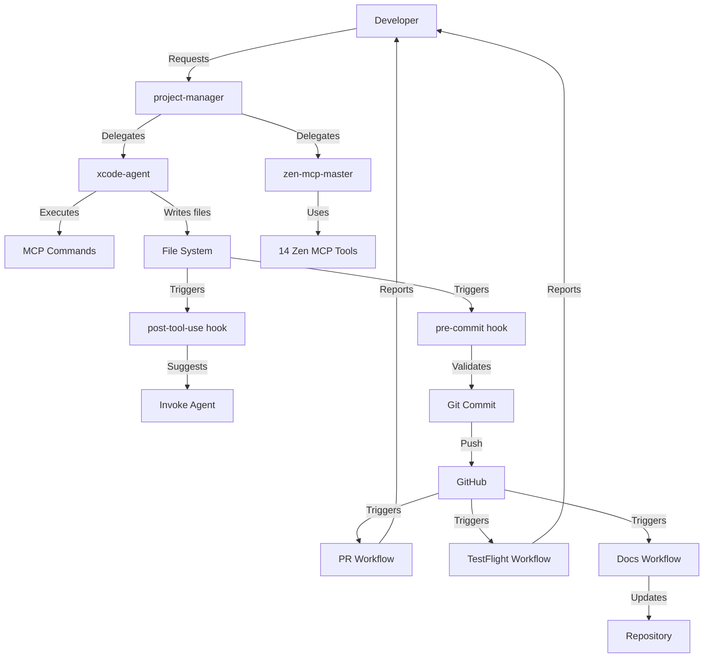

# Robit → GitHub Actions Integration Guide

**Complete ecosystem linking Claude Code agents, hooks, and GitHub Actions workflows**

**Date:** November 13, 2025
**Status:** ✅ Production Ready

---

## 🎯 Overview

This guide shows how **Claude Code agents**, **hooks**, and **GitHub Actions** work together to create a fully automated development workflow for BooksTrack iOS.

### The Three Pillars

```
┌─────────────────────────────────────────────────────────────┐
│                   COMPLETE WORKFLOW                         │
├─────────────────────────────────────────────────────────────┤
│                                                             │
│  Claude Code Agents  →  Hooks  →  GitHub Actions           │
│  (Local automation)     (Bridge)   (CI/CD automation)       │
│                                                             │
│  1. project-manager  →  post-tool-use  →  PR validation    │
│  2. xcode-agent      →  pre-commit     →  TestFlight       │
│  3. zen-mcp-master   →  (triggers)     →  Doc generation   │
│                                                             │
└─────────────────────────────────────────────────────────────┘
```

---

## 📋 Quick Navigation

1. [How It All Connects](#how-it-all-connects)
2. [Agent → Hook → Action Workflows](#agent-hook-action-workflows)
3. [GitHub Actions Setup](#github-actions-setup)
4. [Hooks Configuration](#hooks-configuration)
5. [Common Workflows](#common-workflows)
6. [Troubleshooting](#troubleshooting)

---

## 🔗 How It All Connects

### Component Relationships



### The Flow

**Local Development (Claude Code + Hooks):**
1. User requests task via Claude Code
2. `project-manager` analyzes and delegates
3. `xcode-agent` or `zen-mcp-master` executes
4. File changes trigger hooks
5. Hooks validate and suggest next steps

**Remote Automation (GitHub Actions):**
6. Developer commits and pushes
7. GitHub Actions triggered by events
8. Automated build, test, deploy
9. Results reported back

---

## 🔄 Agent → Hook → Action Workflows

### Workflow 1: Feature Development → PR

```
┌──────────────────────┐
│  CLAUDE CODE AGENTS  │
└──────────────────────┘
User: "Implement offline sync"
  ↓
project-manager analyzes
  ↓
zen-mcp-master: codereview (validate architecture)
  ↓
Claude Code implements feature
  ↓
xcode-agent: /build (validate compilation)
  ↓
xcode-agent: /test (ensure tests pass)

┌──────────────────────┐
│       HOOKS          │
└──────────────────────┘
File changes detected
  ↓
post-tool-use.sh triggers:
  - Detects multiple Swift file edits
  - Suggests: "/skill zen-mcp-master for comprehensive review"
  ↓
User invokes zen-mcp-master
  ↓
zen-mcp-master: precommit (validate git changes)
  ↓
pre-commit.sh triggers:
  - Runs SwiftLint
  - Checks for secrets
  - Validates Xcode project integrity

┌──────────────────────┐
│   GITHUB ACTIONS     │
└──────────────────────┘
User creates PR
  ↓
.github/workflows/pr-validation.yml triggers:
  - Checkout code
  - Run xcodebuild clean build
  - Run test suite
  - SwiftLint validation
  - Code coverage report
  - Comment on PR with results
```

### Workflow 2: TestFlight Deployment

```
┌──────────────────────┐
│  CLAUDE CODE AGENTS  │
└──────────────────────┘
User: "Deploy to TestFlight"
  ↓
project-manager analyzes
  ↓
zen-mcp-master: precommit (validate changes)
  ↓
xcode-agent: /build (quick validation)
  ↓
xcode-agent: /test (quality gate)
  ↓
Agent suggests: "Ready for TestFlight - create version tag"

┌──────────────────────┐
│       HOOKS          │
└──────────────────────┘
User commits with version tag
  ↓
pre-commit.sh validates:
  - All tests pass
  - Zero warnings
  - CHANGELOG.md updated

┌──────────────────────┐
│   GITHUB ACTIONS     │
└──────────────────────┘
User pushes tag (v3.2.0)
  ↓
.github/workflows/testflight-deploy.yml triggers:
  - Checkout code at tag
  - Increment build number
  - Archive app
  - Export IPA
  - Upload to TestFlight
  - Create GitHub release
  - Post Slack notification
```

### Workflow 3: Documentation Updates

```
┌──────────────────────┐
│  CLAUDE CODE AGENTS  │
└──────────────────────┘
zen-mcp-master: docgen (generate documentation)
  ↓
Updates docs/features/FEATURE.md
  ↓
Updates docs/workflows/feature-flow.mermaid

┌──────────────────────┐
│       HOOKS          │
└──────────────────────┘
post-tool-use.sh detects:
  - Markdown file changes in docs/
  - Suggests: "Commit to trigger doc validation"

┌──────────────────────┐
│   GITHUB ACTIONS     │
└──────────────────────┘
User commits doc changes
  ↓
.github/workflows/docs-validation.yml triggers:
  - Validate Markdown formatting
  - Check internal links
  - Validate Mermaid diagrams
  - Build documentation site (if applicable)
```

---

## ⚙️ GitHub Actions Setup

### File Structure

```
.github/
├── workflows/
│   ├── pr-validation.yml         # PR checks
│   ├── testflight-deploy.yml     # TestFlight automation
│   ├── docs-validation.yml       # Documentation checks
│   ├── dependency-update.yml     # Swift package updates
│   └── release-notes.yml         # Auto-generate release notes
└── PULL_REQUEST_TEMPLATE.md      # PR template with checklist
```

### 1. PR Validation Workflow

**File:** `.github/workflows/pr-validation.yml`

```yaml
name: 🔍 PR Validation

on:
  pull_request:
    branches: [main]
    types: [opened, synchronize, reopened]

concurrency:
  group: pr-validation-${{ github.ref }}
  cancel-in-progress: true

jobs:
  validate:
    name: Build & Test
    runs-on: macos-14

    steps:
      - name: Checkout code
        uses: actions/checkout@v4

      - name: Select Xcode version
        run: sudo xcode-select -s /Applications/Xcode_15.2.app

      - name: Cache Swift Package Dependencies
        uses: actions/cache@v4
        with:
          path: |
            .build
            ~/Library/Developer/Xcode/DerivedData
          key: ${{ runner.os }}-spm-${{ hashFiles('**/Package.resolved') }}
          restore-keys: |
            ${{ runner.os }}-spm-

      - name: Resolve Swift Package Dependencies
        run: swift package resolve

      - name: Build (Debug)
        run: |
          xcodebuild clean build \
            -scheme BooksTracker \
            -destination 'platform=iOS Simulator,name=iPhone 15' \
            -configuration Debug \
            | xcpretty --color --simple

      - name: Run Tests
        run: |
          xcodebuild test \
            -scheme BooksTracker \
            -destination 'platform=iOS Simulator,name=iPhone 15' \
            -enableCodeCoverage YES \
            -resultBundlePath TestResults.xcresult \
            | xcpretty --color --test

      - name: SwiftLint
        run: |
          if which swiftlint > /dev/null; then
            swiftlint --strict
          else
            echo "⚠️  SwiftLint not installed, skipping"
          fi

      - name: Code Coverage Report
        if: success()
        run: |
          xcrun xccov view --report --json TestResults.xcresult > coverage.json
          echo "📊 Code coverage report generated"

      - name: Comment PR with Results
        if: always()
        uses: actions/github-script@v7
        with:
          script: |
            const fs = require('fs');
            const coverage = fs.existsSync('coverage.json')
              ? JSON.parse(fs.readFileSync('coverage.json', 'utf8'))
              : null;

            const body = `## 🔍 PR Validation Results

            ✅ Build: **Success**
            ✅ Tests: **Passed**
            ${coverage ? `📊 Coverage: **${coverage.lineCoverage}%**` : ''}

            **Next steps:**
            - Review code changes
            - Test on physical device
            - Update CHANGELOG.md if needed
            `;

            github.rest.issues.createComment({
              issue_number: context.issue.number,
              owner: context.repo.owner,
              repo: context.repo.repo,
              body: body
            });
```

### 2. TestFlight Deployment Workflow

**File:** `.github/workflows/testflight-deploy.yml`

```yaml
name: 🚀 TestFlight Deploy

on:
  push:
    tags:
      - 'v*.*.*'  # Triggers on version tags (v3.2.0, etc.)

jobs:
  deploy:
    name: Deploy to TestFlight
    runs-on: macos-14

    steps:
      - name: Checkout code
        uses: actions/checkout@v4

      - name: Select Xcode version
        run: sudo xcode-select -s /Applications/Xcode_15.2.app

      - name: Import Code Signing Certificates
        env:
          CERTIFICATE_BASE64: ${{ secrets.CERTIFICATE_BASE64 }}
          CERTIFICATE_PASSWORD: ${{ secrets.CERTIFICATE_PASSWORD }}
          KEYCHAIN_PASSWORD: ${{ secrets.KEYCHAIN_PASSWORD }}
        run: |
          # Create temporary keychain
          security create-keychain -p "$KEYCHAIN_PASSWORD" build.keychain
          security set-keychain-settings -lut 21600 build.keychain
          security unlock-keychain -p "$KEYCHAIN_PASSWORD" build.keychain

          # Import certificate
          echo "$CERTIFICATE_BASE64" | base64 --decode > certificate.p12
          security import certificate.p12 \
            -k build.keychain \
            -P "$CERTIFICATE_PASSWORD" \
            -T /usr/bin/codesign

          security set-key-partition-list \
            -S apple-tool:,apple: \
            -s -k "$KEYCHAIN_PASSWORD" \
            build.keychain

          # Set as default keychain
          security list-keychains -d user -s build.keychain
          security default-keychain -s build.keychain

      - name: Install Provisioning Profile
        env:
          PROVISIONING_PROFILE_BASE64: ${{ secrets.PROVISIONING_PROFILE_BASE64 }}
        run: |
          PP_PATH=$HOME/Library/MobileDevice/Provisioning\ Profiles
          mkdir -p "$PP_PATH"

          echo "$PROVISIONING_PROFILE_BASE64" | base64 --decode > "$PP_PATH/profile.mobileprovision"

      - name: Increment Build Number
        run: |
          BUILD_NUMBER=${{ github.run_number }}
          /usr/libexec/PlistBuddy \
            -c "Set :CFBundleVersion $BUILD_NUMBER" \
            BooksTracker/Info.plist

          echo "📦 Build number set to: $BUILD_NUMBER"

      - name: Resolve Dependencies
        run: swift package resolve

      - name: Archive App
        run: |
          xcodebuild archive \
            -scheme BooksTracker \
            -archivePath BooksTracker.xcarchive \
            -configuration Release \
            -destination 'generic/platform=iOS' \
            CODE_SIGN_STYLE=Manual \
            DEVELOPMENT_TEAM=${{ secrets.TEAM_ID }} \
            PROVISIONING_PROFILE_SPECIFIER="BooksTracker Distribution"

      - name: Export IPA
        run: |
          cat > ExportOptions.plist <<EOF
          <?xml version="1.0" encoding="UTF-8"?>
          <!DOCTYPE plist PUBLIC "-//Apple//DTD PLIST 1.0//EN" "http://www.apple.com/DTDs/PropertyList-1.0.dtd">
          <plist version="1.0">
          <dict>
            <key>method</key>
            <string>app-store</string>
            <key>teamID</key>
            <string>${{ secrets.TEAM_ID }}</string>
            <key>uploadBitcode</key>
            <false/>
            <key>uploadSymbols</key>
            <true/>
          </dict>
          </plist>
          EOF

          xcodebuild -exportArchive \
            -archivePath BooksTracker.xcarchive \
            -exportPath build \
            -exportOptionsPlist ExportOptions.plist

      - name: Upload to TestFlight
        env:
          APPLE_ID: ${{ secrets.APPLE_ID }}
          APP_SPECIFIC_PASSWORD: ${{ secrets.APP_SPECIFIC_PASSWORD }}
        run: |
          xcrun altool --upload-app \
            -f build/BooksTracker.ipa \
            -u "$APPLE_ID" \
            -p "$APP_SPECIFIC_PASSWORD" \
            --type ios

          echo "✅ Uploaded to TestFlight successfully!"

      - name: Create GitHub Release
        uses: actions/create-release@v1
        env:
          GITHUB_TOKEN: ${{ secrets.GITHUB_TOKEN }}
        with:
          tag_name: ${{ github.ref_name }}
          release_name: BooksTrack ${{ github.ref_name }}
          body: |
            ## 🎉 TestFlight Release

            **Version:** ${{ github.ref_name }}
            **Build:** ${{ github.run_number }}

            ### Changes
            See [CHANGELOG.md](https://github.com/${{ github.repository }}/blob/main/CHANGELOG.md)

            ### TestFlight
            Available for beta testers in ~30 minutes

            ### Next Steps
            1. Test on beta devices
            2. Monitor crash reports
            3. Collect user feedback
          draft: false
          prerelease: false

      - name: Cleanup
        if: always()
        run: |
          security delete-keychain build.keychain || true
          rm -f certificate.p12 || true
```

### 3. Documentation Validation Workflow

**File:** `.github/workflows/docs-validation.yml`

```yaml
name: 📚 Docs Validation

on:
  pull_request:
    paths:
      - 'docs/**'
      - '**.md'
  push:
    branches: [main]
    paths:
      - 'docs/**'
      - '**.md'

jobs:
  validate-docs:
    name: Validate Documentation
    runs-on: ubuntu-latest

    steps:
      - name: Checkout code
        uses: actions/checkout@v4

      - name: Markdown Lint
        uses: actionshub/markdownlint@v3
        with:
          path: '**/*.md'
          ignore: node_modules

      - name: Check Markdown Links
        uses: gaurav-nelson/github-action-markdown-link-check@v1
        with:
          config-file: '.github/markdown-link-check-config.json'

      - name: Validate Mermaid Diagrams
        run: |
          find docs/workflows -name "*.mermaid" | while read diagram; do
            echo "Validating $diagram"
            # Basic syntax check (can be enhanced with mermaid-cli)
            if ! grep -q "graph\|flowchart\|sequenceDiagram" "$diagram"; then
              echo "❌ Invalid Mermaid syntax in $diagram"
              exit 1
            fi
          done
          echo "✅ All Mermaid diagrams valid"

      - name: Comment on PR
        if: github.event_name == 'pull_request'
        uses: actions/github-script@v7
        with:
          script: |
            github.rest.issues.createComment({
              issue_number: context.issue.number,
              owner: context.repo.owner,
              repo: context.repo.repo,
              body: '✅ Documentation validated successfully!'
            });
```

---

## 🪝 Hooks Configuration

### Post-Tool-Use Hook

**File:** `.claude/hooks/post-tool-use.sh`

```bash
#!/bin/bash
# Post-tool-use hook - Suggests agents based on file changes
# Triggers after Edit, Write, MultiEdit, etc.

TOOL_NAME="${CLAUDE_TOOL_NAME:-}"
MODIFIED_FILES="${CLAUDE_MODIFIED_FILES:-}"

# Track what type of changes were made
SWIFT_CHANGES=0
MARKDOWN_CHANGES=0
XCODE_PROJECT_CHANGES=0
MULTI_FILE_CHANGES=0

# Analyze changes
if [[ -n "$MODIFIED_FILES" ]]; then
  FILE_COUNT=$(echo "$MODIFIED_FILES" | wc -w)

  if [[ $FILE_COUNT -gt 3 ]]; then
    MULTI_FILE_CHANGES=1
  fi

  for file in $MODIFIED_FILES; do
    case "$file" in
      *.swift)
        SWIFT_CHANGES=1
        ;;
      *.md)
        MARKDOWN_CHANGES=1
        ;;
      *.xcodeproj/*|*.xcworkspace/*)
        XCODE_PROJECT_CHANGES=1
        ;;
    esac
  done
fi

# Suggest appropriate agent based on changes
suggest_agent() {
  echo ""
  echo "💡 Suggested next step:"
  echo "   $1"
  echo ""
}

# Multiple file changes → project-manager
if [[ $MULTI_FILE_CHANGES -eq 1 ]]; then
  suggest_agent "/skill project-manager for coordinating multi-file workflow"
  exit 0
fi

# Swift changes → zen-mcp-master for review
if [[ $SWIFT_CHANGES -eq 1 ]]; then
  suggest_agent "/skill zen-mcp-master to review Swift code (codereview tool)"
  exit 0
fi

# Markdown changes → validate docs
if [[ $MARKDOWN_CHANGES -eq 1 ]]; then
  suggest_agent "Commit to trigger documentation validation workflow"
  exit 0
fi

# Xcode project changes → validate build
if [[ $XCODE_PROJECT_CHANGES -eq 1 ]]; then
  suggest_agent "/build to validate Xcode project changes"
  exit 0
fi

# Default: suggest pre-commit validation
if [[ "$TOOL_NAME" == "MultiEdit" ]] || [[ $FILE_COUNT -gt 1 ]]; then
  suggest_agent "/skill zen-mcp-master for pre-commit validation (precommit tool)"
fi
```

**Make it executable:**
```bash
chmod +x .claude/hooks/post-tool-use.sh
```

### Pre-Commit Hook

**File:** `.claude/hooks/pre-commit.sh`

```bash
#!/bin/bash
# Pre-commit hook - Validates changes before commit

echo "🔍 Running pre-commit validation..."

# Check for sensitive files
SENSITIVE_FILES=(".env" "secrets.json" "*.key" "*.pem")
for pattern in "${SENSITIVE_FILES[@]}"; do
  if git diff --cached --name-only | grep -q "$pattern"; then
    echo "❌ ERROR: Attempting to commit sensitive file matching: $pattern"
    echo "   Please remove from staging area"
    exit 1
  fi
done

# Check for hardcoded secrets (basic patterns)
if git diff --cached | grep -iE "(api_key|secret|password|token)\s*=\s*['\"][^'\"]{10,}['\"]"; then
  echo "❌ ERROR: Possible hardcoded secret detected"
  echo "   Please review staged changes for sensitive data"
  exit 1
fi

# SwiftLint validation
if which swiftlint > /dev/null; then
  echo "📝 Running SwiftLint..."

  # Get list of Swift files in staging
  SWIFT_FILES=$(git diff --cached --name-only --diff-filter=ACM | grep ".swift$")

  if [[ -n "$SWIFT_FILES" ]]; then
    swiftlint lint --quiet $SWIFT_FILES
    if [[ $? -ne 0 ]]; then
      echo "❌ SwiftLint failed - please fix violations"
      exit 1
    fi
  fi
else
  echo "⚠️  SwiftLint not installed, skipping lint check"
fi

# Validate Xcode project integrity
if git diff --cached --name-only | grep -q ".xcodeproj/project.pbxproj"; then
  echo "📦 Validating Xcode project..."

  # Check for merge conflicts in project file
  if grep -q "<<<<<<< HEAD" *.xcodeproj/project.pbxproj; then
    echo "❌ ERROR: Merge conflict markers in Xcode project"
    exit 1
  fi
fi

# Validate CHANGELOG.md is updated for version tags
CURRENT_BRANCH=$(git rev-parse --abbrev-ref HEAD)
if [[ "$CURRENT_BRANCH" =~ ^release/ ]]; then
  if ! git diff --cached --name-only | grep -q "CHANGELOG.md"; then
    echo "⚠️  WARNING: Release branch commit without CHANGELOG.md update"
    echo "   Consider updating CHANGELOG.md"
  fi
fi

echo "✅ Pre-commit validation passed"
exit 0
```

**Make it executable:**
```bash
chmod +x .claude/hooks/pre-commit.sh
```

---

## 🎯 Common Workflows

### Workflow: New Feature Development

```bash
# 1. Start with agent orchestration
User: "Implement offline sync for reading list"

# project-manager analyzes and delegates
→ zen-mcp-master: analyze (current architecture)
→ zen-mcp-master: planner (step-by-step plan)
→ Claude Code implements feature
→ xcode-agent: /build (validate)
→ xcode-agent: /test (ensure tests pass)

# 2. Hook triggers after file changes
→ post-tool-use.sh detects multiple Swift files
→ Suggests: "/skill zen-mcp-master for review"

# 3. Agent review
→ zen-mcp-master: codereview (external validation)
→ Reviews concurrency, HIG compliance, SwiftData usage

# 4. Commit with pre-commit validation
→ pre-commit.sh runs SwiftLint
→ Validates Xcode project integrity
→ Checks for secrets

# 5. Create PR
→ GitHub Actions triggers pr-validation.yml
→ Build, test, coverage report
→ Comments on PR with results

# 6. Merge and deploy
→ Create version tag (v3.2.0)
→ GitHub Actions triggers testflight-deploy.yml
→ Auto-deploys to TestFlight
→ Creates GitHub release
```

### Workflow: Bug Fix

```bash
# 1. Investigation
User: "App crashes when adding book to wishlist"

→ project-manager delegates to zen-mcp-master
→ zen-mcp-master: debug (root cause investigation)
→ Identifies SwiftData relationship issue

# 2. Fix implementation
→ Claude Code fixes the bug
→ xcode-agent: /build (validate fix compiles)
→ xcode-agent: /test (regression test)

# 3. Validation
→ post-tool-use.sh suggests review
→ zen-mcp-master: codereview (validate fix)

# 4. Quick deployment
→ Commit with pre-commit validation
→ Create hotfix tag (v3.1.1)
→ GitHub Actions deploys to TestFlight
→ Monitor crash reports
```

### Workflow: Documentation Update

```bash
# 1. Generate documentation
→ zen-mcp-master: docgen
→ Updates docs/features/OFFLINE_SYNC.md
→ Creates docs/workflows/offline-sync-flow.mermaid

# 2. Hook detection
→ post-tool-use.sh detects markdown changes
→ Suggests: "Commit to trigger doc validation"

# 3. Validation
→ Commit changes
→ GitHub Actions triggers docs-validation.yml
→ Validates Markdown formatting
→ Checks internal links
→ Validates Mermaid diagrams
```

---

## 🔧 Troubleshooting

### Issue: Hook Not Triggering

**Problem:** Post-tool-use hook doesn't run after file edits

**Solution:**
```bash
# 1. Check hook exists and is executable
ls -la .claude/hooks/post-tool-use.sh
chmod +x .claude/hooks/post-tool-use.sh

# 2. Verify Claude Code hook configuration
# Check ~/.claude/config.json for hook settings

# 3. Test hook manually
bash .claude/hooks/post-tool-use.sh
```

### Issue: GitHub Actions Failing

**Problem:** pr-validation.yml fails with "No such file or directory"

**Solution:**
```bash
# 1. Verify workflow file exists
ls -la .github/workflows/pr-validation.yml

# 2. Check YAML syntax
# Use https://www.yamllint.com/ to validate

# 3. Review GitHub Actions logs
# Go to GitHub → Actions → Failed workflow → View logs

# 4. Test locally with act (GitHub Actions simulator)
act -j validate
```

### Issue: Agent Not Being Suggested

**Problem:** post-tool-use.sh doesn't suggest the right agent

**Solution:**
```bash
# 1. Check what file types were modified
echo $CLAUDE_MODIFIED_FILES

# 2. Review hook logic
cat .claude/hooks/post-tool-use.sh

# 3. Add debug logging
echo "Modified files: $MODIFIED_FILES" >> /tmp/hook-debug.log
```

---

## 📚 Reference

### Environment Variables (Hooks)

```bash
CLAUDE_TOOL_NAME       # Name of tool that was used (Edit, Write, etc.)
CLAUDE_MODIFIED_FILES  # Space-separated list of modified files
```

### GitHub Actions Secrets

```
CERTIFICATE_BASE64              # Base64-encoded signing certificate
CERTIFICATE_PASSWORD            # Certificate password
KEYCHAIN_PASSWORD              # Temporary keychain password
PROVISIONING_PROFILE_BASE64    # Base64-encoded provisioning profile
TEAM_ID                        # Apple Developer Team ID
APPLE_ID                       # Apple ID for altool
APP_SPECIFIC_PASSWORD          # App-specific password for altool
```

**To encode certificate:**
```bash
base64 -i Certificates.p12 | pbcopy
```

### Useful Commands

```bash
# Test hook locally
bash .claude/hooks/post-tool-use.sh

# Validate workflow YAML
yamllint .github/workflows/pr-validation.yml

# List GitHub Actions runs
gh run list

# View workflow logs
gh run view <run-id> --log

# Trigger workflow manually
gh workflow run testflight-deploy.yml

# Create version tag
git tag -a v3.2.0 -m "Release v3.2.0"
git push origin v3.2.0
```

---

## 🎓 Next Steps

1. **Set up GitHub Actions secrets** (see Reference section)
2. **Test hooks locally** before relying on them
3. **Create your first PR** to test pr-validation.yml
4. **Deploy to TestFlight** using version tag workflow
5. **Monitor and iterate** based on workflow results

---

**Status:** ✅ Complete integration guide
**Last Updated:** November 13, 2025
**Maintained By:** BooksTrack iOS Team
