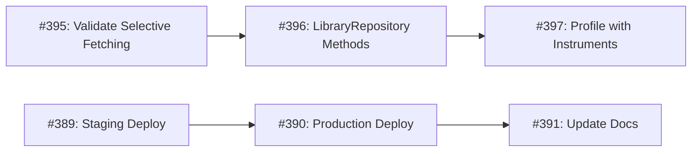

# BooksTrack Sprint Roadmap
**Generated:** November 13, 2025
**Planning Horizon:** 6 weeks (3 sprints × 2 weeks)
**Consensus Validation:** ✅ Qwen 3 Coder + Grok Code Fast 1

## 🎯 Strategic Overview

**Validated by Expert Consensus:**
- **Qwen 3 Coder (Pragmatic Velocity):** Sprint structure balances quality and delivery speed
- **Grok Code Fast 1 (Technical Architecture):** Prioritization mitigates scalability risks and technical debt

**Key Adjustments from Consensus:**
1. ✅ Moved selective fetching (#395-397) to Sprint 1 (critical stability)
2. ✅ Added `type/scalability` label for long-term architectural tracking
3. ✅ Deferred low-priority UX (#434-437) to backlog
4. ✅ Elevated backend coordination items to high priority

---

## 🚀 Sprint 1: Critical Quality & Compliance
**Dates:** November 13-27, 2025 (2 weeks)
**Theme:** App Store compliance, backend API stability, memory optimization
**Risk Level:** 🔴 High (backend coordination + scalability work)

### Sprint Goals
1. Eliminate App Store rejection risks (WCAG compliance)
2. Migrate to canonical backend endpoints before deprecation
3. Validate CloudKit sync with selective fetching for large libraries
4. Prevent memory-related crashes on constrained devices

### Issues (7 total)

#### 🔴 CRITICAL: Accessibility & Compliance
- **#430** - Fix WCAG AA contrast violation in WorkDetailView author names
  - **Priority:** HIGH
  - **Labels:** `bug`, `priority/high`, `type/accessibility`, `sprint/1`
  - **Effort:** 5 minutes
  - **Risk:** App Store rejection
  - **Owner:** TBD
  - **Deliverable:** Stronger text shadows (opacity 0.95, double shadow)

#### 🔴 CRITICAL: Backend API Migration
- **#425** - Migrate to /v1/enrichment/batch canonical endpoint
  - **Priority:** HIGH (January 2026 deprecation deadline)
  - **Labels:** `priority/high`, `type/backend-coordination`, `sprint/1`
  - **Effort:** 30 minutes
  - **Dependencies:** Backend v1 endpoint availability
  - **Owner:** TBD
  - **Deliverable:** Update `EnrichmentAPIClient.swift`, verify response format

- **#427** - Review WebSocket implementation against backend handoff spec
  - **Priority:** HIGH
  - **Labels:** `priority/high`, `type/backend-coordination`, `sprint/1`
  - **Effort:** 2-4 hours (validation + regression testing)
  - **Risk:** Cross-repo coordination required
  - **Owner:** TBD
  - **Deliverable:** WebSocket validation report, fix any regressions

#### 🟡 HIGH: Memory & Scalability (Consensus Elevation)
- **#395** - [Phase 4] Validate selective fetching with CloudKit
  - **Priority:** HIGH
  - **Labels:** `priority/high`, `type/performance`, `type/scalability`, `sprint/1`
  - **Effort:** 2 hours (test implementation)
  - **Why Elevated:** Critical for 1000+ book library stability
  - **Owner:** TBD
  - **Deliverable:** Validation test demonstrating memory reduction

- **#396** - [Phase 4.2] Implement LibraryRepository convenience methods
  - **Priority:** HIGH
  - **Labels:** `priority/high`, `type/performance`, `type/scalability`, `sprint/1`
  - **Effort:** 1 hour
  - **Blocked By:** #395 must pass
  - **Owner:** TBD
  - **Deliverable:** `fetchUserLibraryForList()`, `fetchWorkDetail()`

- **#397** - [Phase 4.3] Profile selective fetching with Instruments
  - **Priority:** HIGH
  - **Labels:** `priority/high`, `type/performance`, `type/scalability`, `sprint/1`
  - **Effort:** 2 hours (requires real device)
  - **Blocked By:** #396 implementation
  - **Owner:** TBD
  - **Deliverable:** Performance report in `docs/performance/`

- **#431** - Implement memory pressure handling for image cache
  - **Priority:** MEDIUM
  - **Labels:** `bug`, `priority/medium`, `category/visual-effects`, `sprint/1`
  - **Effort:** 15 minutes
  - **Flex Item:** Move to Sprint 2 if scope overload
  - **Owner:** TBD
  - **Deliverable:** `UIApplication.didReceiveMemoryWarningNotification` observer

### Sprint 1 Success Criteria
- [ ] Zero WCAG AA violations (measured with accessibility inspector)
- [ ] `/v1/enrichment/batch` endpoint operational in production
- [ ] WebSocket validation report confirms no regressions
- [ ] Selective fetching reduces memory by 70% for list views (measured with Instruments)
- [ ] All items build with zero warnings (Swift 6 compliance)

### Sprint 1 Risk Mitigation
⚠️ **High Risk:** Backend coordination items (#425, #427)
- **Mitigation:** Daily sync with backend team, clear API contracts
- **Escalation:** If blocked, create cross-repo issues in bookstrack-backend

⚠️ **Medium Risk:** Selective fetching + CloudKit sync validation
- **Mitigation:** Phase 4.3 profiling on real device (not simulator)
- **Fallback:** Document limitation if CloudKit incompatible, recommend DTO pattern

---

## 🎨 Sprint 2: Performance & UX Polish
**Dates:** November 27 - December 11, 2025 (2 weeks)
**Theme:** UI responsiveness, cognitive load reduction, import optimizations
**Risk Level:** 🟡 Medium

### Sprint Goals
1. Eliminate UI blocking on main thread (diversity calculations)
2. Reduce information density in library header
3. Optimize ImportService for large CSV files
4. Deploy Phase 3 backend changes to staging/production

### Issues (7 total)

#### 🟡 Performance Optimization
- **#432** - Move diversity calculation off main thread
  - **Priority:** MEDIUM
  - **Labels:** `enhancement`, `priority/medium`, `category/scroll-dynamics`, `type/performance`, `sprint/2`
  - **Effort:** 30 minutes
  - **Owner:** TBD
  - **Deliverable:** Async `calculateDiversityScoreAsync()` with debouncing

- **#393** - Optimize ImportService deduplication (predicate-based fetching)
  - **Priority:** MEDIUM
  - **Labels:** `type/performance`, `sprint/2`
  - **Effort:** 1-2 hours
  - **Owner:** TBD
  - **Deliverable:** Replace in-memory filtering with database predicates

- **#394** - [Phase 4] Add cancellation support to ImportService
  - **Priority:** MEDIUM
  - **Labels:** `type/performance`, `sprint/2`
  - **Effort:** 1 hour
  - **Owner:** TBD
  - **Deliverable:** Task cancellation for large CSV imports

#### 🎨 UX Improvements
- **#433** - Reduce information density in library header
  - **Priority:** MEDIUM
  - **Labels:** `enhancement`, `priority/medium`, `type/ios26-enhancement`, `sprint/2`
  - **Effort:** 1-2 hours
  - **Owner:** TBD
  - **Deliverable:** Progressive disclosure or collapsible stats (iPhone SE tested)

#### 🔧 Backend Phase 3 Deployment
- **#389** - Deploy to staging and validate dual-format responses
  - **Labels:** `type/backend-coordination`, `sprint/2`
  - **Effort:** 2-3 hours (coordinated deployment)
  - **Owner:** TBD
  - **Deliverable:** Staging validation report

- **#390** - Production deployment and monitoring
  - **Labels:** `type/backend-coordination`, `sprint/2`
  - **Effort:** 1-2 hours (deployment + monitoring)
  - **Dependencies:** #389 staging success
  - **Owner:** TBD
  - **Deliverable:** Production deployment checklist

- **#391** - Update documentation
  - **Labels:** `documentation`, `sprint/2`
  - **Effort:** 30 minutes
  - **Owner:** TBD
  - **Deliverable:** Updated API docs in `docs/`

#### Flex from Sprint 1
- **#431** - Memory pressure handling (if not completed in Sprint 1)

### Sprint 2 Success Criteria
- [ ] Diversity calculation runs off main thread (0ms UI blocking)
- [ ] Library header tested on iPhone SE (no cognitive overload)
- [ ] ImportService handles 1000+ row CSV with <5s deduplication
- [ ] Phase 3 backend deployed to production with monitoring
- [ ] All performance improvements profiled with Instruments

---

## 🌟 Sprint 3: Enhancements & Future-Proofing
**Dates:** December 11-25, 2025 (2 weeks)
**Theme:** Error handling, backend coordination, observability
**Risk Level:** 🟢 Low

### Sprint Goals
1. Improve user experience for rate-limited API calls
2. Coordinate backend observability enhancements
3. Reduce ISBNdb dependency costs

### Issues (4 total)

#### 🎨 User Experience
- **#426** - Implement rate limit countdown timer UI (429 errors)
  - **Priority:** MEDIUM
  - **Labels:** `priority/medium`, `type/backend-coordination`, `sprint/3`
  - **Effort:** 1-2 hours
  - **Owner:** TBD
  - **Deliverable:** `RateLimitBanner.swift` with countdown timer

#### 🔧 Backend Coordination
- **#365** - WebSocket Enhancements Phase 3: Observability & Monitoring
  - **Labels:** `enhancement`, `status/backlog`, `priority/medium`, `source/cloudflare-workers`, `type/backend-coordination`, `sprint/3`
  - **Effort:** 3-4 hours (cross-team coordination)
  - **Owner:** TBD (Jules tagged)
  - **Deliverable:** Enhanced WebSocket monitoring dashboard

- **#201** - Remove ISBNdb dependency to reduce costs
  - **Labels:** `enhancement`, `priority/low`, `source/cloudflare-workers`, `type/backend-coordination`, `sprint/3`
  - **Effort:** 2-3 hours (backend migration)
  - **Owner:** TBD
  - **Deliverable:** ISBNdb removal plan, cost savings report

### Sprint 3 Success Criteria
- [ ] Rate limit UI tested with simulated 429 responses
- [ ] WebSocket observability metrics accessible in dashboard
- [ ] ISBNdb cost reduction quantified (monthly savings)

---

## 📦 Backlog (Deferred)
**Rationale:** Low user impact, defer to maintain sprint focus on critical work

### Deferred Low-Priority UX Enhancements
- **#434** - Add visual press feedback to book cards
  - **Labels:** `enhancement`, `priority/low`, `category/gestures`, `category/animations`, `status/backlog`
  - **Defer Reason:** Polish, not blocking users

- **#435** - Tighten adaptive grid range to prevent layout jumps
  - **Labels:** `enhancement`, `priority/low`, `type/ios26-enhancement`, `status/backlog`
  - **Defer Reason:** Edge case, low user complaints

- **#436** - Add skeleton screens for initial library load
  - **Labels:** `enhancement`, `priority/low`, `category/visual-effects`, `category/animations`, `status/backlog`
  - **Defer Reason:** Perceived performance, not actual performance

- **#437** - Implement cover image prefetching in search results
  - **Labels:** `enhancement`, `priority/low`, `category/scroll-dynamics`, `status/backlog`
  - **Defer Reason:** Optimization, not critical for 600ms launch target

### Future Web Build (No Timeline)
- **#428** - Implement CORS error handling for web builds
  - **Labels:** `priority/low`, `type/backend-coordination`, `status/backlog`
  - **Defer Reason:** Capacitor builds work fine, web builds not planned

---

## 📊 Sprint Metrics & Velocity

### Sprint Capacity Estimates
- **Sprint 1:** 7 issues, ~10 hours effort (HIGH risk, backend coordination)
- **Sprint 2:** 7 issues, ~8 hours effort (MEDIUM risk, performance profiling)
- **Sprint 3:** 4 issues, ~6 hours effort (LOW risk, enhancements)

### Critical Path Dependencies

### Risk Assessment Matrix
| Issue | Risk Level | Impact | Likelihood | Mitigation |
|-------|------------|--------|------------|------------|
| #427  | 🔴 HIGH    | HIGH   | MEDIUM     | Daily backend sync, clear contracts |
| #395-397 | 🔴 HIGH | HIGH   | LOW        | Real device testing, fallback to DTOs |
| #425  | 🟡 MEDIUM  | HIGH   | LOW        | Deprecation deadline Jan 2026 |
| #389-391 | 🟡 MEDIUM | MEDIUM | MEDIUM   | Staged rollout, monitoring |
| All others | 🟢 LOW | LOW-MED | LOW    | Standard development practices |

---

## 🏷️ Label Taxonomy

### New Labels Created
- `type/backend-coordination` - Issues requiring backend team collaboration
- `type/performance` - Performance optimization work
- `type/accessibility` - WCAG compliance and accessibility
- `type/scalability` - Scalability and large dataset handling (per Grok recommendation)
- `sprint/1`, `sprint/2`, `sprint/3` - Sprint assignment

### Existing Labels Applied
- Priority: `priority/high`, `priority/medium`, `priority/low`
- Status: `status/backlog`, `status/in-progress`, `status/completed`
- Category: `category/scroll-dynamics`, `category/visual-effects`, `category/animations`, `category/gestures`
- Type: `type/ios26-enhancement`, `type/feature`, `type/decision`
- Source: `source/cloudflare-workers` (backend issues)

---

## 🎯 Success Metrics (6-Week Horizon)

### Quality Metrics
- [ ] Zero WCAG AA violations
- [ ] Zero Swift 6 compiler warnings
- [ ] Zero production crashes (memory pressure)
- [ ] 100% backend API migration to v1 endpoints

### Performance Metrics
- [ ] <600ms cold launch (maintained)
- [ ] <20MB memory for 1000-book library list views (70% reduction)
- [ ] 0ms UI blocking during diversity calculations (down from 50-100ms)
- [ ] <5s CSV import deduplication for 1000+ rows

### User Experience Metrics
- [ ] Rate limit errors display countdown timer (100% coverage)
- [ ] Library header tested on iPhone SE (cognitive load validated)
- [ ] WebSocket observability dashboard operational

---

## 🚦 Go/No-Go Criteria

### Sprint 1 Gate (Nov 27)
✅ **GO if:**
- WCAG AA violations fixed
- `/v1/enrichment/batch` endpoint validated
- Selective fetching shows ≥60% memory reduction

❌ **NO-GO if:**
- WebSocket regression found (escalate to backend team)
- CloudKit sync breaks with selective fetching (implement DTO fallback)

### Sprint 2 Gate (Dec 11)
✅ **GO if:**
- Phase 3 backend deployed to production
- ImportService optimizations complete
- UI blocking eliminated (measured with Instruments)

### Sprint 3 Gate (Dec 25)
✅ **GO if:**
- Rate limit UI functional
- ISBNdb removal plan approved
- All backlog items reviewed for next quarter

---

## 📞 Escalation & Communication

### Backend Coordination Channels
- **Issues requiring backend work:** Create cross-repo issues in `bookstrack-backend`
- **WebSocket issues:** Tag Jules (@jules in #365)
- **API deprecation:** Backend team notified of January 2026 deadline (#425)

### Sprint Review Meetings
- **Sprint 1 Review:** Nov 27 (demo WCAG fixes, selective fetching profiling)
- **Sprint 2 Review:** Dec 11 (demo performance improvements, Phase 3 deployment)
- **Sprint 3 Review:** Dec 25 (demo rate limit UI, observability dashboard)

### Retrospective Focus Areas
- **Sprint 1:** Backend coordination effectiveness, cross-repo workflow
- **Sprint 2:** Performance profiling tools, Instruments usage
- **Sprint 3:** Backlog prioritization, Q1 2026 planning

---

**Last Updated:** November 13, 2025
**Next Review:** November 27, 2025 (Sprint 1 completion)
**Consensus Validation:** ✅ Qwen 3 Coder (8/10 confidence) + Grok Code Fast 1 (8/10 confidence)
