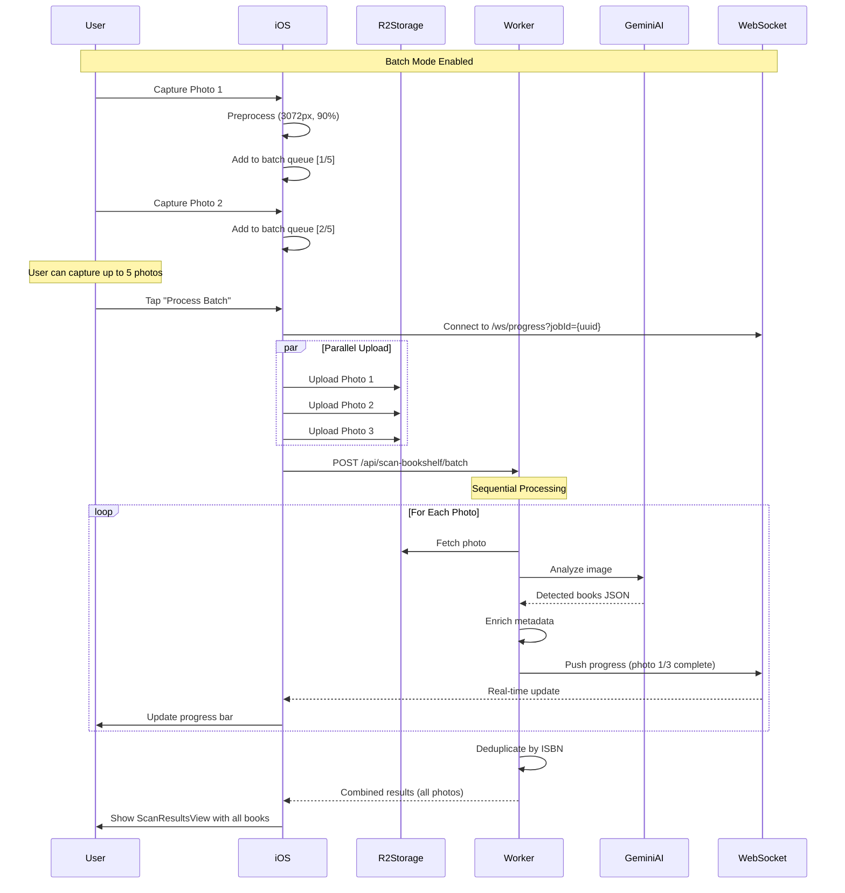
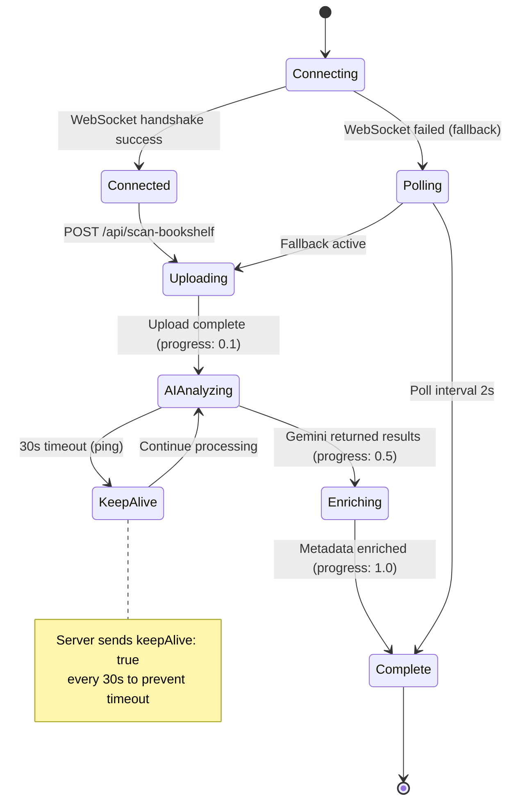
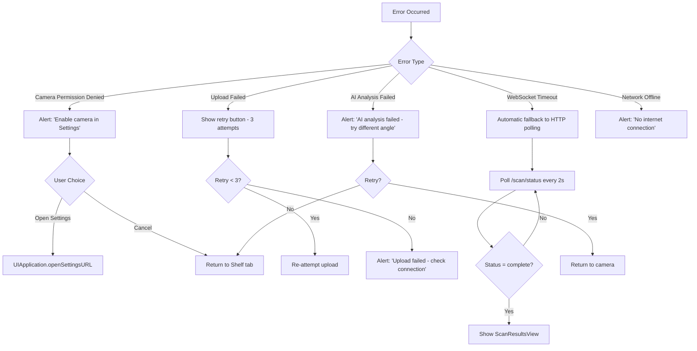

# Bookshelf Scanner Workflow

**Feature:** AI-Powered Bookshelf Camera Scanner
**Technology:** Gemini 2.0 Flash (2M token context window)
**Primary Flow:** User photographs bookshelf → AI detects books → Review & import
**Last Updated:** October 2025

---

## User Journey Flow

```mermaid
flowchart TD
    Start([User Opens Shelf Tab]) --> ModeCheck{Scanning Mode?}

    ModeCheck -->|Single Photo| SingleMode[Single Photo Mode Active]
    ModeCheck -->|Batch Mode| BatchMode[Batch Mode Active - 5 photos max]

    SingleMode --> RequestPermission{Camera Permission?}
    BatchMode --> RequestPermission

    RequestPermission -->|Not Determined| ShowPermissionPrompt[Request AVCaptureDevice access]
    RequestPermission -->|Denied| ShowSettings[Show 'Enable in Settings' message]
    RequestPermission -->|Authorized| ShowCamera[Display live camera preview]

    ShowPermissionPrompt --> PermissionResponse{User Response}
    PermissionResponse -->|Granted| ShowCamera
    PermissionResponse -->|Denied| ShowSettings

    ShowCamera --> UserCapture[User taps capture button]
    UserCapture --> ShowReview[Show preview sheet]

    ShowReview --> ReviewChoice{User Action?}
    ReviewChoice -->|Retake| ShowCamera
    ReviewChoice -->|Use Photo| ProcessPhoto

    ProcessPhoto --> Preprocess[iOS: Resize to 3072px @ 90% quality]
    Preprocess --> CheckBatch{Batch Mode?}

    CheckBatch -->|No - Single| UploadSingle[Upload to /api/scan-bookshelf]
    CheckBatch -->|Yes| AddToQueue[Add to batch queue]

    AddToQueue --> MorePhotos{Captured < 5 photos?}
    MorePhotos -->|Yes| ShowCamera
    MorePhotos -->|No| UploadBatch[Upload to /api/scan-bookshelf/batch]

    UploadSingle --> ConnectWS[Connect WebSocket /ws/progress]
    UploadBatch --> ConnectWS

    ConnectWS --> WSConnected{WebSocket Status}
    WSConnected -->|Connected| StreamProgress[Stream real-time progress]
    WSConnected -->|Failed| FallbackPolling[Fallback to HTTP polling]

    StreamProgress --> AIProcessing[Gemini 2.0 Flash Analysis - 25-40s]
    FallbackPolling --> AIProcessing

    AIProcessing --> EnrichBooks[Backend enriches metadata - 5-10s]
    EnrichBooks --> ReceiveResults[Receive DetectedBook array]

    ReceiveResults --> ShowResults[Display ScanResultsView]

    ShowResults --> ConfidenceCheck{For each book}
    ConfidenceCheck -->|Confidence ≥ 60%| AutoVerify[Import as .verified]
    ConfidenceCheck -->|Confidence < 60%| NeedsReview[Import as .needsReview]

    AutoVerify --> AddToLibrary[Create Work + UserLibraryEntry]
    NeedsReview --> AddToReviewQueue[Add to Review Queue]

    AddToLibrary --> QueueEnrichment[Queue for background enrichment]
    AddToReviewQueue --> AddToLibrary

    QueueEnrichment --> ShowBanner[Show EnrichmentProgressBanner]
    ShowBanner --> Complete([Scan Complete])

    ShowSettings --> End([User Exits])
    ReviewChoice -->|Cancel| End
```

---

## Batch Scanning Flow (5 Photos Max)

---

## WebSocket Progress State Machine

---

## Review Queue Integration

```mermaid
flowchart LR
    Results[Scan Results] --> CheckConfidence{For each book}

    CheckConfidence -->|≥60%| HighConf[High Confidence]
    CheckConfidence -->|<60%| LowConf[Low Confidence]

    HighConf --> SetVerified[work.reviewStatus = .verified]
    LowConf --> SetNeedsReview[work.reviewStatus = .needsReview]

    SetNeedsReview --> StoreMetadata[Store originalImagePath + boundingBox]
    StoreMetadata --> SaveWork[Insert Work into SwiftData]

    SetVerified --> SaveWork

    SaveWork --> UserReview[User opens Review Queue]
    UserReview --> CropImage[CorrectionView shows cropped spine]
    CropImage --> UserEdit{User Action}

    UserEdit -->|Edit title/author| MarkEdited[reviewStatus = .userEdited]
    UserEdit -->|No changes| MarkVerified[reviewStatus = .verified]

    MarkEdited --> CleanupCheck[Check if all books from scan reviewed]
    MarkVerified --> CleanupCheck

    CleanupCheck -->|Yes| DeleteImage[Delete temp image file on next launch]
    CleanupCheck -->|No| KeepImage[Keep image for other books]
```

---

## Key Components

| Component | Responsibility | File |
|-----------|---------------|------|
| **BookshelfScannerView** | Main UI coordinator | `BookshelfScannerView.swift` |
| **BookshelfCameraSessionManager** | AVFoundation camera session | `BookshelfCameraSessionManager.swift` (@BookshelfCameraActor) |
| **BookshelfAIService** | API client for scan endpoint | `BookshelfAIService.swift:837` |
| **WebSocketProgressManager** | Real-time progress tracking | `WebSocketProgressManager.swift` |
| **ScanResultsView** | Results display & import | `ScanResultsView.swift` |
| **ReviewQueueView** | Low-confidence book review | `ReviewQueueView.swift` |
| **ImageCleanupService** | Automatic temp file cleanup | `ImageCleanupService.swift` |

---

## Error Handling

---

## Performance Optimizations

1. **iOS Preprocessing:** Resize to 3072px @ 90% quality (400-600KB)
2. **WebSocket Keep-Alive:** 30s pings prevent timeout during 25-40s AI processing
3. **Automatic Fallback:** Switches to HTTP polling if WebSocket fails (<5% fallback rate)
4. **Batch Parallel Upload:** Upload 5 photos concurrently to R2, process sequentially
5. **Temp File Cleanup:** Automatic deletion after all books from scan reviewed

---

## Data Flow (iOS → Backend)

```mermaid
graph LR
    A[UIImage] -->|jpegData 90%| B[Data 400-600KB]
    B -->|URLRequest| C[POST /api/scan-bookshelf]
    C -->|FormData| D[Cloudflare Worker]
    D -->|Base64 encode| E[Gemini Vision API]
    E -->|JSON response| F[DetectedBook array]
    F -->|Enrich metadata| G[Search handlers]
    G -->|Push via WebSocket| H[JobProgress updates]
    H -->|URLSessionWebSocketTask| I[iOS UI update]
```

---

## Related Documentation

- **Feature Documentation:** `docs/features/BOOKSHELF_SCANNER.md`
- **Batch Scanning:** `docs/features/BATCH_BOOKSHELF_SCANNING.md`
- **Review Queue:** `docs/features/REVIEW_QUEUE.md`
- **WebSocket Architecture:** `docs/WEBSOCKET_ARCHITECTURE.md`
- **Backend Implementation:** `cloudflare-workers/api-worker/src/services/ai-scanner.js`

---

## Success Metrics

| Metric | Target | Current |
|--------|--------|---------|
| AI Accuracy (≥60% confidence) | 80%+ | 70-95% (varies by shelf clarity) |
| Processing Time | <60s | 25-40s (AI) + 5-10s (enrichment) |
| WebSocket Success Rate | >95% | ~95% (5% fallback to polling) |
| User Retention (complete scan) | >70% | TBD (analytics pending) |

---

## Future Enhancements

- [ ] Multi-shelf stitching (panorama mode)
- [ ] Real-time detection (live viewfinder overlay)
- [ ] Confidence threshold customization (user setting)
- [ ] Export detected books as CSV
- [ ] Apple Watch remote shutter control
