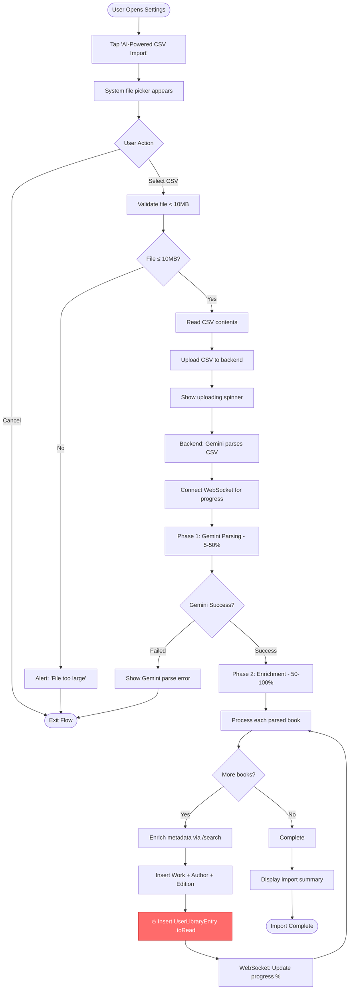
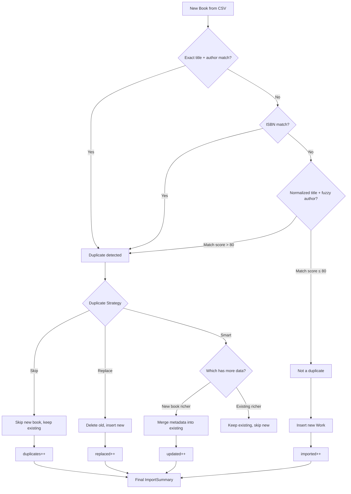
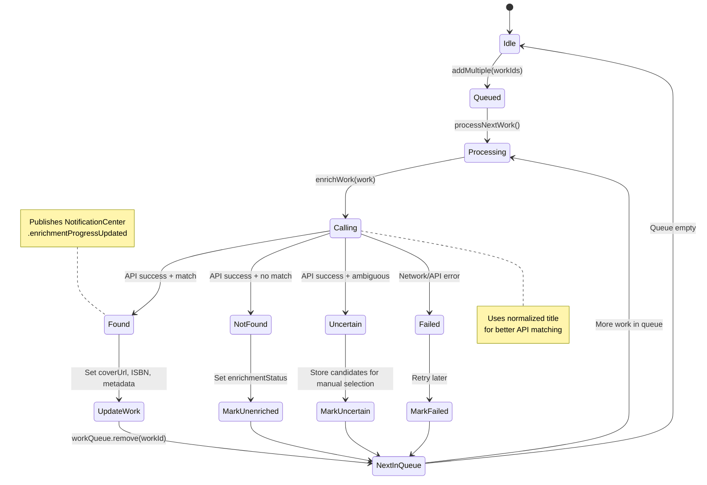
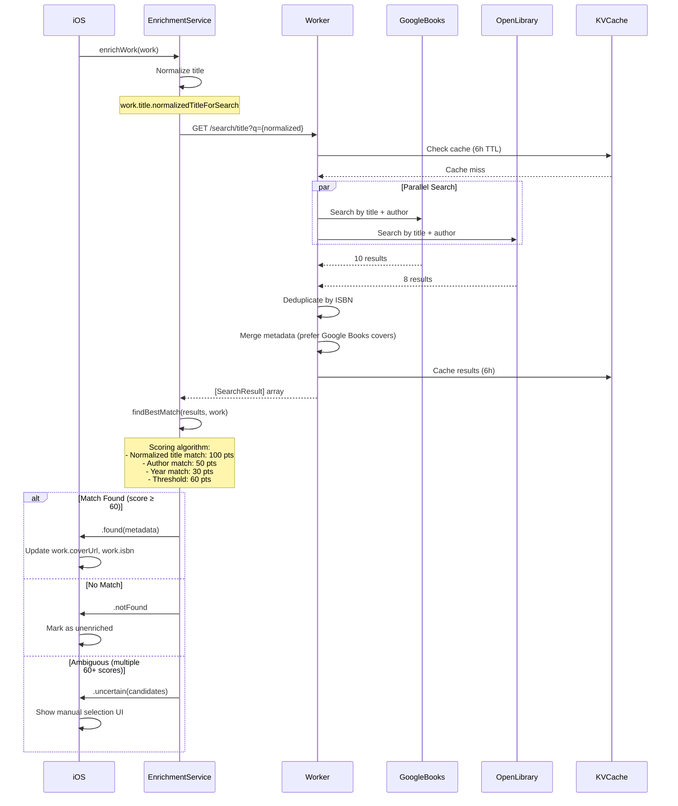
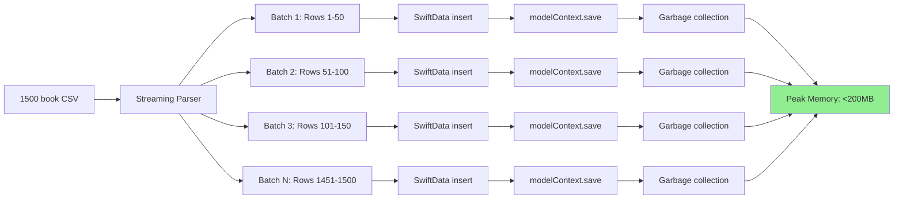
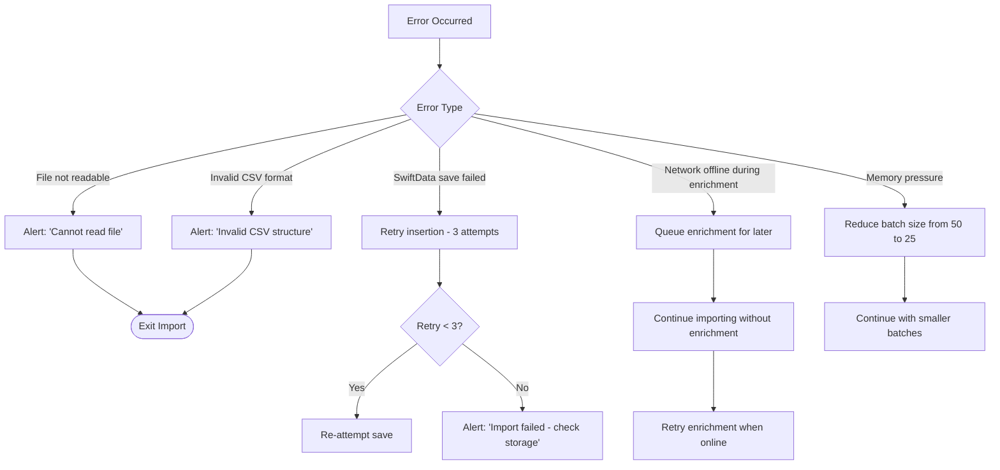

# CSV Import Workflow

**Feature:** AI-Powered CSV Import (Gemini)
**Status:** ✅ Production (v3.1.0+)
**Supported Formats:** Any CSV with title/author/ISBN (auto-detected by Gemini)
**Performance:** Backend-processed with real-time WebSocket progress
**Last Updated:** October 2025

**⚠️ Note:** This doc describes the **current Gemini AI-powered import**. Legacy manual CSV import was deprecated in v3.3.0 (October 2025) and archived to `docs/archive/features-removed/CSV_IMPORT.md`.

---

## User Journey Flow (Gemini AI Import)



**🔥 CRITICAL: UserLibraryEntry Creation**

The `UserLibraryEntry` step (highlighted in red above) is **required** for books to appear in the Library view:

- **Without UserLibraryEntry:** Books are saved to SwiftData but remain invisible in the UI
- **Why:** `LibraryFilterService.filterLibraryWorks()` filters out works with empty `userLibraryEntries`
- **Default Status:** CSV imports create entries with `.toRead` status
- **Code Reference:** `GeminiCSVImportView.swift:505-510`, `LibraryFilterService.swift:20-30`

This step was added in commit 086384b to fix the "CSV import books not appearing in library" issue.

---

## Title Normalization Flow

```mermaid
flowchart LR
    Raw[Raw CSV Title] --> Examples["Examples:<br/>- Harry Potter (Series, #1)<br/>- The da Vinci Code: The Young Adult Adaptation<br/>- 1984 [50th Anniversary Edition]"]

    Examples --> Step1[Remove series markers: \(..., #\d+\)]
    Step1 --> Step2[Remove edition markers: \[...\]]
    Step2 --> Step3[Strip subtitles after ':' if length > 10]
    Step3 --> Step4[Remove abbreviation periods]
    Step4 --> Step5[Normalize whitespace]

    Step5 --> TwoVersions{Store Two Versions}

    TwoVersions -->|Display| Original[work.title = original]
    TwoVersions -->|API Search| Normalized[normalizedTitle used in searches]

    Original --> SwiftData[Save to SwiftData]
    Normalized --> APICall[EnrichmentService.enrichWork]

    APICall --> BetterMatch[90%+ enrichment success rate]

    style BetterMatch fill:#90EE90
```

---

## Duplicate Detection Algorithm



---

## Background Enrichment State Machine



---

## API Integration (Backend)



---

## Memory Management (Batch Processing)



---

## Key Components (Gemini CSV Import)

| Component | Responsibility | File |
|-----------|---------------|------|
| **GeminiCSVImportView** | Upload + progress UI + **UserLibraryEntry creation** | `GeminiCSVImport/GeminiCSVImportView.swift` |
| **GeminiCSVImportService** | Backend API client | `GeminiCSVImport/GeminiCSVImportService.swift` |
| **EnrichmentService** | Fetches book metadata | `Enrichment/EnrichmentService.swift` |
| **EnrichmentQueue** | Manages background enrichment | `Enrichment/EnrichmentQueue.swift` |
| **LibraryFilterService** | Filters works by UserLibraryEntry (line 20-30) | `Services/LibraryFilterService.swift` |
| **api-worker** | Gemini parsing + enrichment | `cloudflare-workers/api-worker/src/handlers/gemini-csv-import.js` |
| **ProgressWebSocketDO** | Real-time progress updates | `cloudflare-workers/api-worker/src/durable-objects/ProgressWebSocketDO.js` |

---

## Error Handling



---

## Performance Benchmarks

| Book Count | Import Time | Enrichment Time | Total | Peak Memory |
|-----------|-------------|-----------------|-------|-------------|
| 100       | ~30s        | ~2-3 min        | ~3.5 min | <50MB |
| 500       | ~2.5 min    | ~10-12 min      | ~14 min | <120MB |
| 1500      | ~7.5 min    | ~30-35 min      | ~42 min | <200MB |

**Success Rates:**
- Duplicate detection: 95%+
- Enrichment success (with normalization): 90%+
- Popular books: 95%+
- Obscure/self-published: 70-80%

---

## Related Documentation

- **Feature Documentation:** `docs/features/GEMINI_CSV_IMPORT.md`
- **Legacy CSV Import (Archived):** `docs/archive/features-removed/CSV_IMPORT.md`
- **WebSocket Progress:** `docs/workflows/enrichment-workflow.md` (shared pattern)
- **Backend Handler:** `cloudflare-workers/api-worker/src/handlers/gemini-csv-import.js`

---

## Future Enhancements

- [ ] Progress persistence across app restarts
- [ ] Partial import recovery (resume after crash)
- [ ] Custom column mapping UI (manual field selection)
- [ ] Export enriched library back to CSV
- [ ] Import from iCloud Drive / Dropbox
- [ ] Automatic backup before destructive imports
