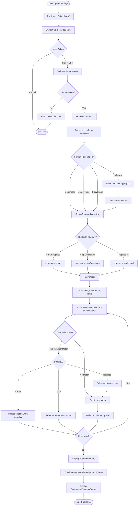
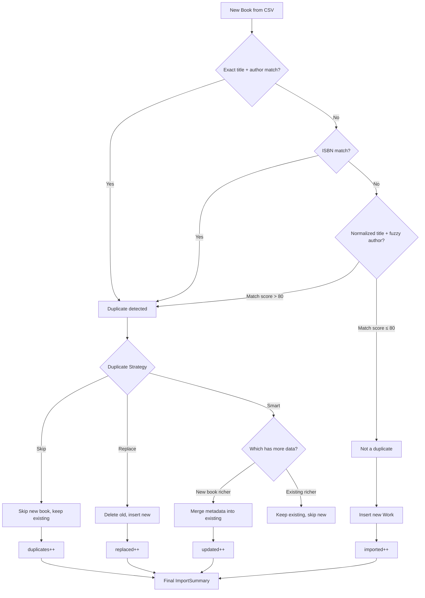
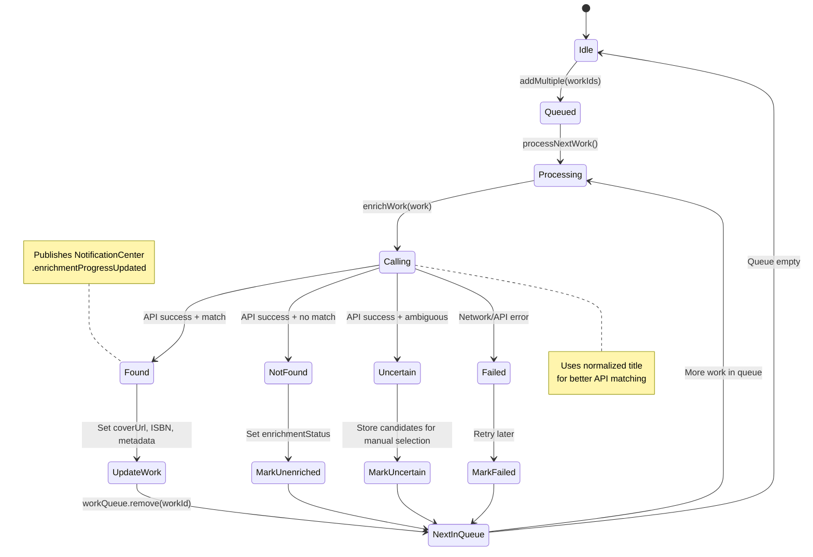
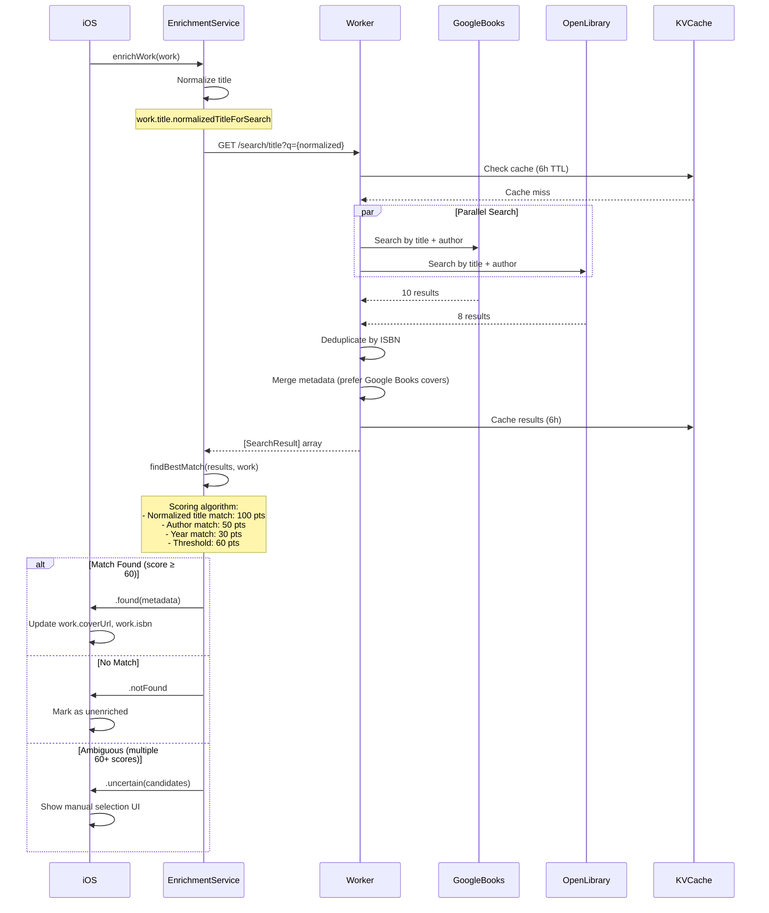
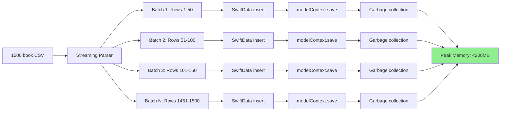

# CSV Import Workflow

**Feature:** Bulk Library Import from CSV Exports
**Supported Formats:** Goodreads, LibraryThing, StoryGraph
**Performance:** 100 books/min, <200MB memory (1500+ books)
**Last Updated:** October 2025

---

## User Journey Flow



---

## Title Normalization Flow

```mermaid
flowchart LR
    Raw[Raw CSV Title] --> Examples["Examples:<br/>- Harry Potter (Series, #1)<br/>- The da Vinci Code: The Young Adult Adaptation<br/>- 1984 [50th Anniversary Edition]"]

    Examples --> Step1[Remove series markers: \(..., #\d+\)]
    Step1 --> Step2[Remove edition markers: \[...\]]
    Step2 --> Step3[Strip subtitles after ':' if length > 10]
    Step3 --> Step4[Remove abbreviation periods]
    Step4 --> Step5[Normalize whitespace]

    Step5 --> TwoVersions{Store Two Versions}

    TwoVersions -->|Display| Original[work.title = original]
    TwoVersions -->|API Search| Normalized[normalizedTitle used in searches]

    Original --> SwiftData[Save to SwiftData]
    Normalized --> APICall[EnrichmentService.enrichWork]

    APICall --> BetterMatch[90%+ enrichment success rate]

    style BetterMatch fill:#90EE90
```

---

## Duplicate Detection Algorithm



---

## Background Enrichment State Machine



---

## API Integration (Backend)



---

## Memory Management (Batch Processing)



---

## Key Components

| Component | Responsibility | File |
|-----------|---------------|------|
| **CSVImportFlowView** | Multi-step import wizard UI | `CSVImportFlowView.swift` |
| **CSVParsingActor** | High-performance CSV parsing | `CSVParsingActor.swift` (@globalActor) |
| **CSVImportService** | SwiftData import orchestration | `CSVImportService.swift` |
| **EnrichmentService** | API metadata enrichment | `EnrichmentService.swift` |
| **EnrichmentQueue** | Background enrichment queue | `EnrichmentQueue.swift` (@MainActor) |
| **String+TitleNormalization** | Title normalization algorithm | `String+TitleNormalization.swift` |
| **EnrichmentProgressBanner** | Real-time progress UI | `EnrichmentProgressBanner.swift` |

---

## Error Handling


---

## Performance Benchmarks

| Book Count | Import Time | Enrichment Time | Total | Peak Memory |
|-----------|-------------|-----------------|-------|-------------|
| 100       | ~30s        | ~2-3 min        | ~3.5 min | <50MB |
| 500       | ~2.5 min    | ~10-12 min      | ~14 min | <120MB |
| 1500      | ~7.5 min    | ~30-35 min      | ~42 min | <200MB |

**Success Rates:**
- Duplicate detection: 95%+
- Enrichment success (with normalization): 90%+
- Popular books: 95%+
- Obscure/self-published: 70-80%

---

## Related Documentation

- **Feature Documentation:** `docs/features/CSV_IMPORT.md`
- **Title Normalization Tests:** `BooksTrackerPackage/Tests/.../StringTitleNormalizationTests.swift`
- **SyncCoordinator:** `docs/architecture/SyncCoordinator-Architecture.md`
- **Enrichment API:** `cloudflare-workers/api-worker/src/handlers/search.js`

---

## Future Enhancements

- [ ] Progress persistence across app restarts
- [ ] Partial import recovery (resume after crash)
- [ ] Custom column mapping UI (manual field selection)
- [ ] Export enriched library back to CSV
- [ ] Import from iCloud Drive / Dropbox
- [ ] Automatic backup before destructive imports
