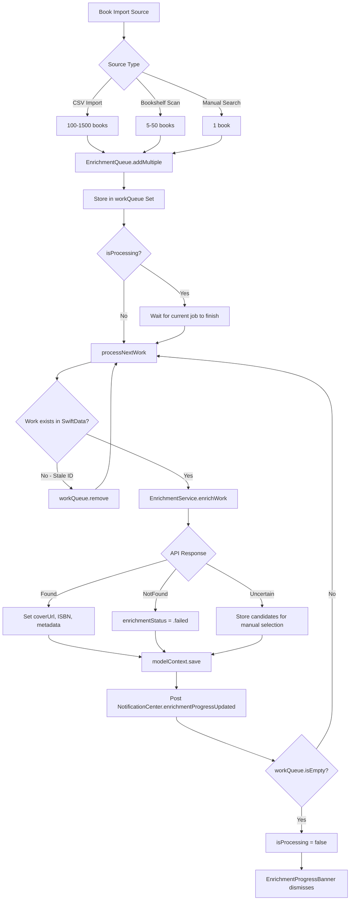
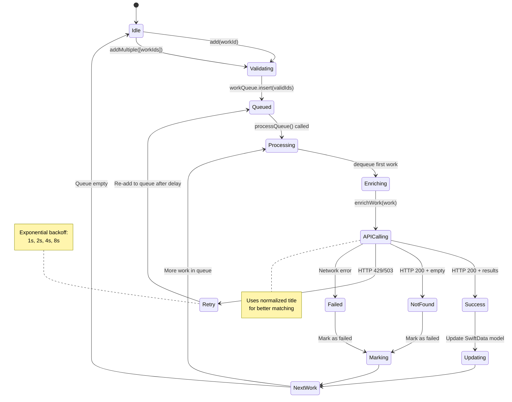
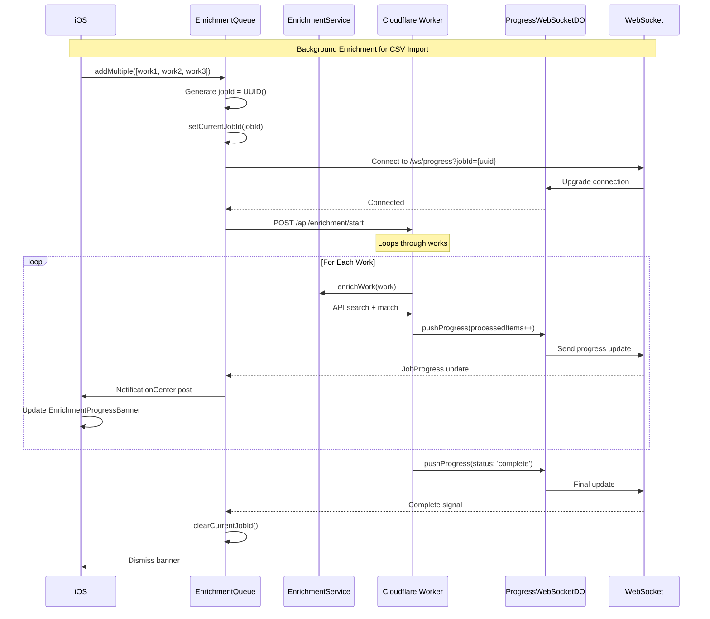
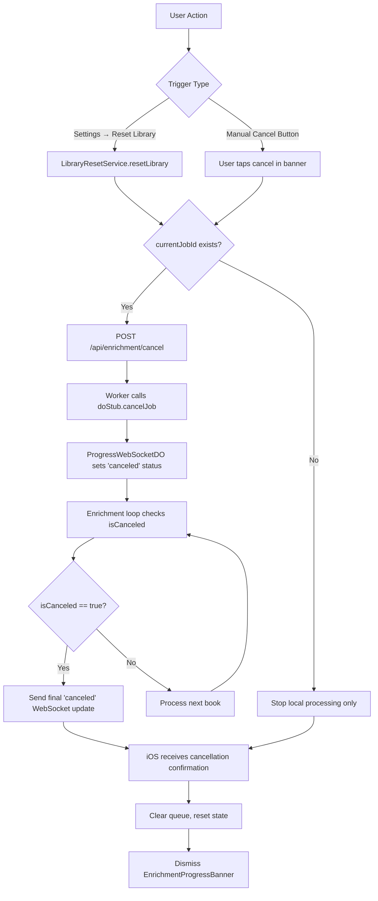
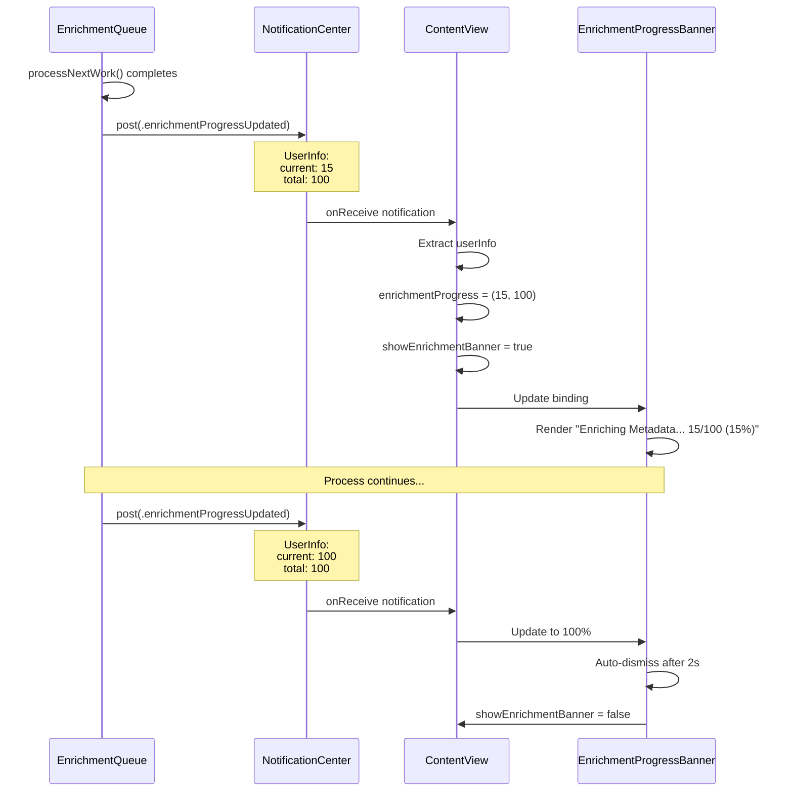
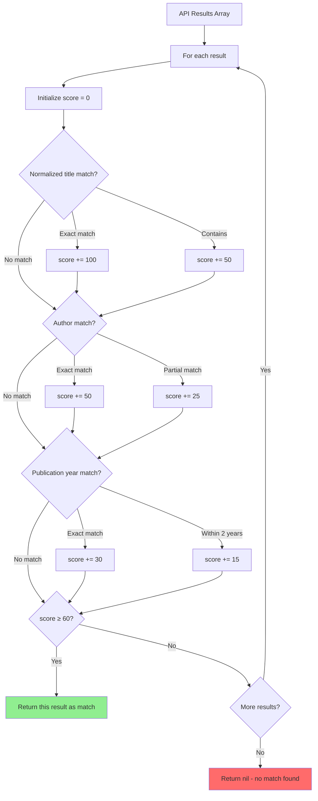

# Metadata Enrichment Workflow

**Feature:** Background Metadata Enrichment System
**Purpose:** Automatically fetch book covers, ISBNs, and metadata after import
**Architecture:** Queue-based background processing with WebSocket progress
**Last Updated:** October 2025

---

## System Overview



---

## Queue Processing State Machine



---

## Backend Job Orchestration (WebSocket)



---

## Job Cancellation Flow



---

## Title Normalization Impact

```mermaid
flowchart LR
    subgraph Before Normalization
        RawTitle["CSV: Harry Potter (Series, #1)"]
        RawAPI[API Search: 'Harry Potter (Series, #1)']
        RawResult[❌ Zero Results - 70% success rate]
    end

    subgraph After Normalization
        NormTitle["CSV: Harry Potter (Series, #1)"]
        NormProcess[Normalized: 'Harry Potter']
        NormAPI[API Search: 'Harry Potter']
        NormResult[✅ 10+ Results - 90%+ success rate]
    end

    RawTitle --> RawAPI --> RawResult
    NormTitle --> NormProcess --> NormAPI --> NormResult

    style RawResult fill:#FF6B6B
    style NormResult fill:#90EE90
```

---

## Progress Notification Architecture



---

## Queue Self-Cleaning Mechanism

```mermaid
flowchart TD
    Startup[App Launch] --> Validate[ContentView.task - validateQueue]

    Validate --> GetQueue[Fetch all IDs from workQueue]

    GetQueue --> LoopIDs[For each PersistentID]

    LoopIDs --> CheckExists{modelContext.model(for: id)?}

    CheckExists -->|Exists| ValidID[Keep in queue]
    CheckExists -->|Throws| StaleID[Remove from queue]

    StaleID --> RemoveSet[workQueue.remove(id)]
    ValidID --> NextID{More IDs?}

    RemoveSet --> NextID

    NextID -->|Yes| LoopIDs
    NextID -->|No| CleanComplete[Queue cleaned]

    CleanComplete --> ProcessQueue[Resume processing valid works]

    style StaleID fill:#FFD93D
    style ValidID fill:#90EE90
```

---

## API Matching Algorithm



---

## Key Components

| Component | Responsibility | File | Actor Isolation |
|-----------|---------------|------|-----------------|
| **EnrichmentQueue** | Queue management & orchestration | `EnrichmentQueue.swift` | @MainActor |
| **EnrichmentService** | API calls & matching logic | `EnrichmentService.swift` | Nonisolated |
| **EnrichmentAPIClient** | HTTP networking layer | `EnrichmentAPIClient.swift` | Nonisolated |
| **EnrichmentProgressBanner** | Real-time progress UI | `EnrichmentProgressBanner.swift` | @MainActor |
| **String+TitleNormalization** | Title cleaning algorithm | `String+TitleNormalization.swift` | Nonisolated |
| **LibraryResetService** | Reset + cancellation logic | `LibraryResetService.swift` | @MainActor |

---

## Error Recovery Strategies

```mermaid
flowchart TD
    Error[Enrichment Failed] --> ErrorType{Error Type}

    ErrorType -->|HTTP 429 Rate Limit| Backoff[Exponential backoff - retry after 1s, 2s, 4s, 8s]
    ErrorType -->|HTTP 503 Service Unavailable| QueueLater[Re-add to queue - retry in 30s]
    ErrorType -->|Network Timeout| RetryImmediate[Retry immediately - 3 attempts max]
    ErrorType -->|HTTP 404 Not Found| MarkPermanent[Mark as permanently failed - don't retry]
    ErrorType -->|Stale PersistentID| RemoveQueue[Remove from queue - SwiftData model deleted]

    Backoff --> CheckRetries{Retry count < 4?}
    CheckRetries -->|Yes| RetryAPI[Re-attempt API call]
    CheckRetries -->|No| MarkFailed[Mark as failed]

    QueueLater --> AddBack[workQueue.insert(id)]
    RetryImmediate --> CheckAttempts{Attempt < 3?}

    CheckAttempts -->|Yes| RetryAPI
    CheckAttempts -->|No| MarkFailed

    MarkPermanent --> StoreError[Store error message in Work model]
    RemoveQueue --> NextWork[Process next work in queue]

    MarkFailed --> NotifyUser[Show error banner]
    RetryAPI --> ProcessWork[Continue enrichment]
```

---

## Performance Optimizations

1. **Batch Processing:** Process 50 works before saving SwiftData context
2. **Queue Deduplication:** Use `Set<PersistentID>` to prevent duplicate enrichment
3. **Stale ID Cleanup:** Validate existence before processing
4. **NotificationCenter:** Lightweight progress updates (no @Published overhead)
5. **Title Normalization:** 20% boost in API success rate

---

## Success Metrics

| Metric | Target | Current | Notes |
|--------|--------|---------|-------|
| Enrichment Success Rate | 85%+ | 90%+ | With title normalization |
| Processing Speed | 100 books/min | ~100 books/min | Network-bound |
| Memory Usage | <200MB | <200MB | For 1500 book queue |
| Queue Stability | Zero stale IDs | ✅ Validated | Self-cleaning on startup |

---

## Related Documentation

- **Feature Documentation:** `docs/features/CSV_IMPORT.md`
- **Title Normalization:** `BooksTrackerPackage/Sources/.../String+TitleNormalization.swift`
- **WebSocket Architecture:** `docs/WEBSOCKET_ARCHITECTURE.md`
- **Backend Enrichment:** `cloudflare-workers/api-worker/src/services/enrichment.js`
- **Job Cancellation:** `CLAUDE.md` - Library Reset section

---

## Future Enhancements

- [ ] Persistent queue across app restarts (UserDefaults or SwiftData)
- [ ] Priority queue (user-triggered enrichment first)
- [ ] Manual retry button for failed enrichments
- [ ] Bulk metadata export (enriched vs unenriched comparison)
- [ ] AI-powered matching (use Gemini for ambiguous results)
- [ ] Offline enrichment (cache API responses locally)
