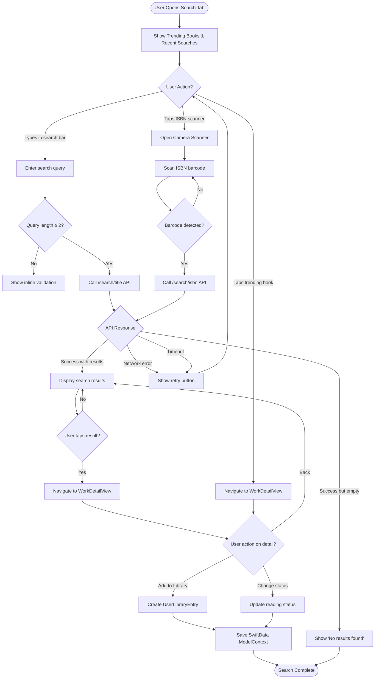
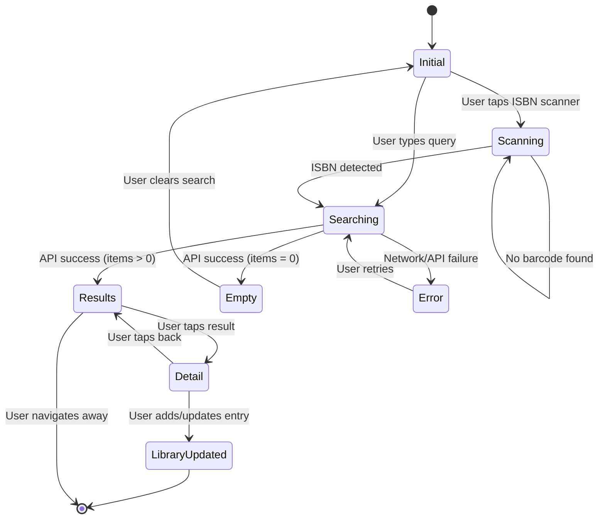
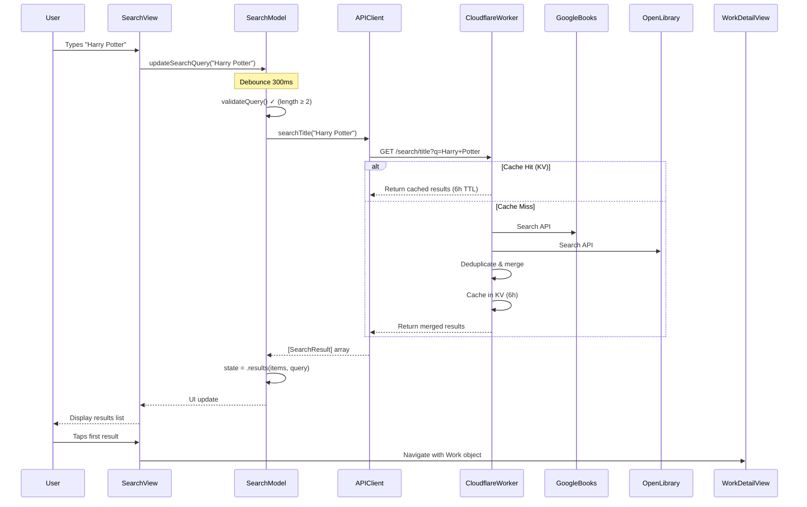
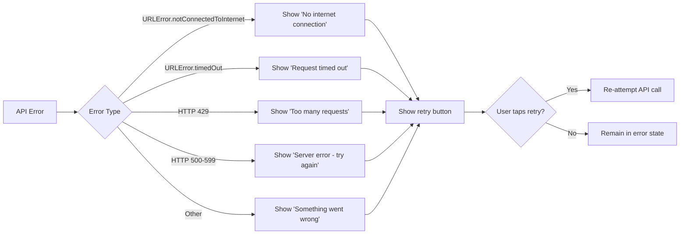

# Search Workflow

**Feature:** Book Search with ISBN Scanner
**Primary Flow:** User searches for books by title, author, or ISBN
**Last Updated:** October 2025

---

## User Journey Flow

---

## State Machine

---

## Sequence Diagram (API Integration)

---

## Key Components

| Component | Responsibility | File |
|-----------|---------------|------|
| **SearchView** | UI rendering, user input | `SearchView.swift` |
| **SearchModel** | State management (@Observable) | `SearchModel.swift:1129` |
| **SearchViewState** | Enum-based state representation | `SearchModel.swift:18-31` |
| **EnrichmentAPIClient** | HTTP requests to Cloudflare Worker | `EnrichmentAPIClient.swift` |
| **ModernBarcodeScannerView** | ISBN camera scanner | `ModernBarcodeScannerView.swift` |

---

## Error Handling

---

## Performance Optimizations

1. **Query Debouncing:** 300ms delay prevents API spam during typing
2. **KV Cache:** 6-hour TTL reduces redundant API calls (Cloudflare Worker)
3. **Batch Deduplication:** Merges Google Books + OpenLibrary results server-side
4. **Lazy Loading:** Results rendered on-demand (no pagination yet)

---

## Related Documentation

- **API Reference:** `cloudflare-workers/api-worker/src/handlers/search.js`
- **Backend Architecture:** `cloudflare-workers/SERVICE_BINDING_ARCHITECTURE.md`
- **State Management:** `CLAUDE.md` - @Observable Pattern
- **Barcode Scanner:** `docs/features/BOOKSHELF_SCANNER.md` (camera permissions)

---

## Future Enhancements

- [ ] Infinite scroll pagination (GitHub Issue TBD)
- [ ] Voice search integration
- [ ] Search history persistence (SwiftData)
- [ ] Advanced filters (genre, publication year)
- [ ] Offline search (local SwiftData cache)
