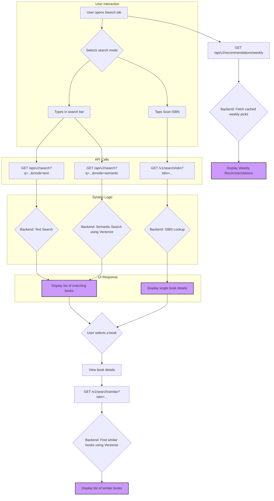

# Search & Discovery Workflows

This document illustrates the primary user workflows for searching for books and discovering new ones.

## Unified Search Workflow

This diagram covers standard text search, ISBN barcode scanning, and the new AI-powered semantic search.

